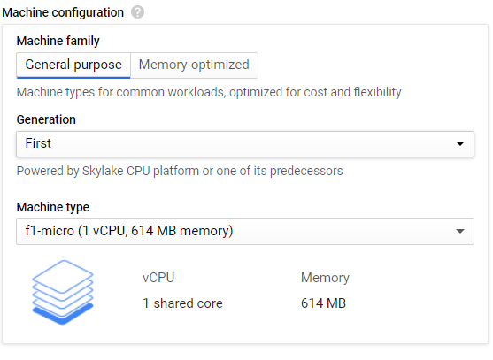

# Random Number Generator

## Compute Engine

For Compute Engine, you must be running a Linux image in Google Cloud Plattform, preferably Ubuntu 18.04 or newer and have the following setup: 
Additionally, make sure to check the "Allow HTTP traffic" box at the bottom of the page [Setup-2].
First, ensure that the following packages are installed. An easy way to check is to run ```dpkg -l {package name}```. If they are not installed, run ```sudo apt install -y {package name}```.
```
apache2
python3
python3-pip
default-jre
default-jdk
```
After these packages have been installed, Apache must be set up to enable CGI scripts. This is accomplished by running the following on the command line:
First, point the python executable at the python3 location:
```
sudo rm /usr/bin/python
sudo ln -s /usr/bin/python3  /usr/bin/python
```
[Code-1.png]
Then, set up the two directories needed for the two implementations of the random number generator:

```
sudo mkdir /var/www/java
sudo mkdir /var/www/python
```
Next, Python must be registered with Apache and Apache configured to execute scripts:
```
sudo a2dismod mpm_event
sudo a2enmod mpm_prefork cgi
```
[Code-3.png]
From here, copy the RandGen.java and RandGen.shtml files into /var/www/java, the index.py file into /var/www/python and make the scripts executable:
[Code-4.png]
```
sudo javac /var/www/java/RandGen.java
sudo chmod 755 /var/www/java/RandGen.shtml
sudo chmod 755 /var/www/python/index.py
```
[Code-5.png]
Next, copy the 000-default.conf into /etc/apache2/sites-enabled/ , overwriting the old conf file.
[Code-6.png]
Almost done! from here, the only thing that needs done is to restart Apache:
```
sudo systemctl restart apache2
```
Alternatively, download and run the setup.sh script, it will do everything for you.
Your random number generator on Compute Engine is now set up! To verify it's random enough, run the ```verify.sh``` file on your server instance. The two implementations are available at {YOUR PUBLIC IP}/python/ and {YOUR PUBLIC IP}/java/RandGen.shtml.
